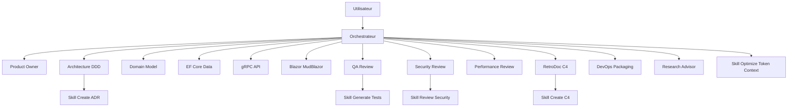

# Cartographie de la squad

```mermaid
flowchart TD
    U[Utilisateur] --> O[Orchestrateur]
    O --> PO[Product Owner]
    O --> ARCH[Architecture DDD]
    O --> DM[Domain Model]
    O --> DATA[EF Core Data]
    O --> GRPC[gRPC API]
    O --> UI[Blazor MudBlazor]
    O --> QA[QA Review]
    O --> SEC[Security Review]
    O --> PERF[Performance Review]
    O --> DOC[RetroDoc C4]
    O --> DEVOPS[DevOps Packaging]
    O --> RES[Research Advisor]

    ARCH --> ADR[Skill Create ADR]
    DOC --> C4[Skill Create C4]
    QA --> TESTS[Skill Generate Tests]
    SEC --> SSEC[Skill Review Security]
    O --> TOK[Skill Optimize Token Context]
```
