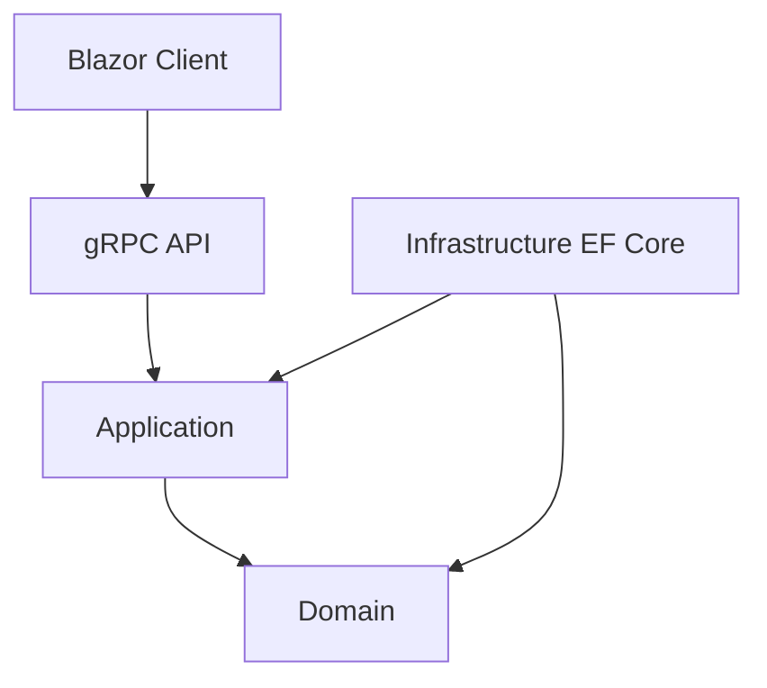

# Principes d'architecture

## Principes structurants

1. Le métier prime sur la technique.
2. Les dépendances vont vers le centre.
3. Les contrats externes ne sont pas le modèle interne.
4. Les décisions structurantes sont documentées en ADR.
5. Les reviews sont systématiques pour les changements transverses.

## Architecture cible

