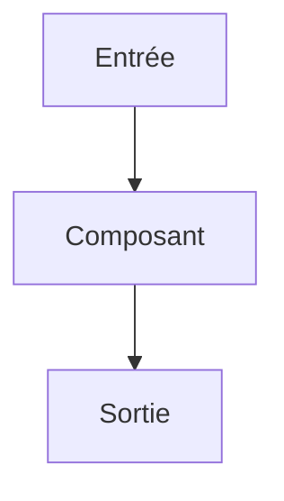

# C4 Component — <Nom du composant>

## Objectif

## Responsabilités

## Dépendances

## Flux principaux

```mermaid
flowchart TD
    A[Entrée] --> B[Composant]
    B --> C[Sortie]
```

## Entrées / Sorties

| Type | Description |
|---|---|

## Points de vigilance
