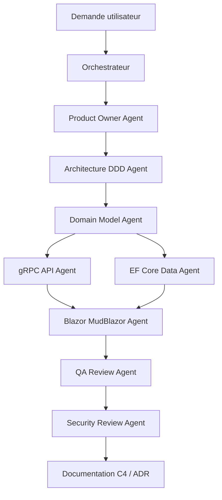

# Workflow cognitif — Feature Pipeline

```mermaid
flowchart TD
    A[Demande utilisateur] --> B[Orchestrateur]
    B --> C[Product Owner Agent]
    C --> D[Architecture DDD Agent]
    D --> E[Domain Model Agent]
    E --> F[gRPC API Agent]
    E --> G[EF Core Data Agent]
    F --> H[Blazor MudBlazor Agent]
    G --> H
    H --> I[QA Review Agent]
    I --> J[Security Review Agent]
    J --> K[Documentation C4 / ADR]
```

## Règle

Aucune feature structurante ne doit passer directement de l'idée au code sans validation architecture et QA.
