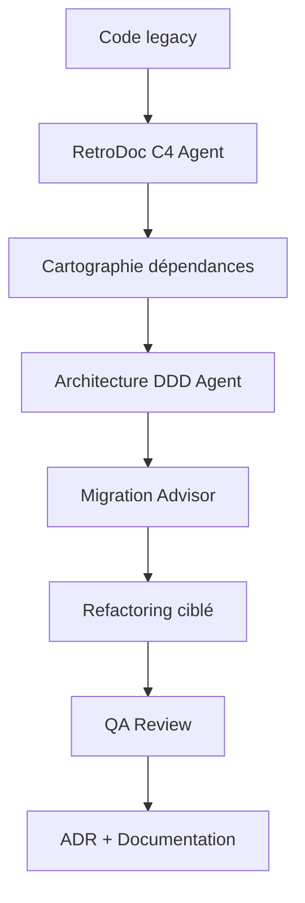

# Workflow cognitif — Modernization Pipeline

```mermaid
flowchart TD
    A[Code legacy] --> B[RetroDoc C4 Agent]
    B --> C[Cartographie dépendances]
    C --> D[Architecture DDD Agent]
    D --> E[Migration Advisor]
    E --> F[Refactoring ciblé]
    F --> G[QA Review]
    G --> H[ADR + Documentation]
```

## Usage

Utiliser pour migration .NET Framework / WCF / WinForms / WPF vers .NET 10, gRPC, Blazor ou services modernes.
