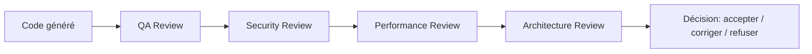

# Workflow cognitif — Review Pipeline

```mermaid
flowchart LR
    A[Code généré] --> B[QA Review]
    B --> C[Security Review]
    C --> D[Performance Review]
    D --> E[Architecture Review]
    E --> F[Décision: accepter / corriger / refuser]
```

## Principe

La génération et la validation sont séparées. Un agent qui produit ne doit pas être le seul agent à valider.
