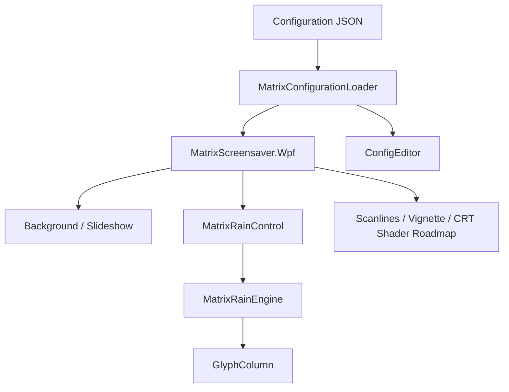

# Architecture

## Principes

- Le moteur ne dépend pas de WPF.
- Le renderer WPF transforme les colonnes en glyphes affichés.
- La configuration est un contrat JSON simple.
- Les presets permettent de changer rapidement d'univers visuel.

## Extensions prévues

- `ShaderEffect` WPF pour CRT réel.
- Masque alpha pour incruster la pluie uniquement dans certaines zones de la photo.
- Réactivité audio.
- Éditeur graphique avec sliders et color picker.
